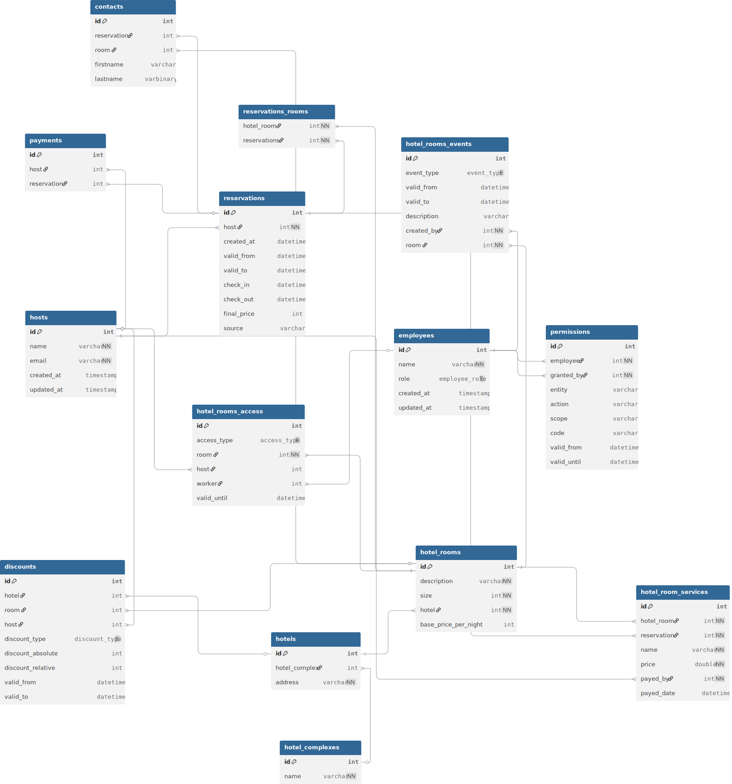
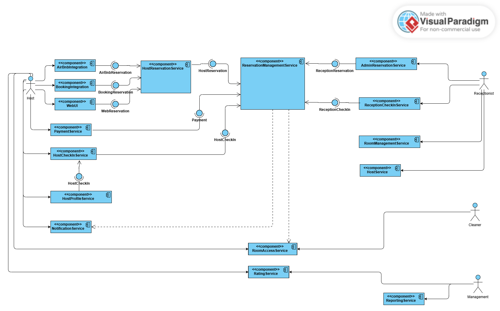

# High level design

Author: Krystof Matejka

## Use-Cases

### Host

#### Create Reservation

- Host creates reservation
- Reservation includes one or more rooms
- Reservation includes one or more people
- Reservation source:
  - Web App
  - Booking
  - Airbnb
- System creates host user account if not exists
- System notifies about created reservation

#### Pay Reservation

- Host pays for reservation
- Supported methods:
  - Card (immediately)
  - Transfer (async background check)
- System notifies about payed reservation

#### Check In

- Host checks-in in Web App or on reception
- System records all people across all rooms
- System grants access keys

#### Check Out

- Host checks-out ïn Web App or on reception
- System transfers the room for cleaning service
- The room is available for next reservation after cleaning
- Host receives satisfaction questionnaire

#### View User Profile

- Host can see past reservations from his profile
- Host can pay his unpaid reservations from his profile
- Host can check in from his profile
- Host can check out from his profile
- Host can manage his contact information

### Receptionist

#### Create Reservation

- Receptionist can create a reservation on behalf of a host
- More details in Host > Create Reservation

#### Check In

- Receptionist can check in a host on his behalf
- More details in Host > Check In

#### Check Out

- Receptionist can check out a host on his behalf
- More details in Host > Check Out

#### Manage Hosts

- Receptionist has overall overview of all hosts from a given hotel

#### Manage Reservations

- Receptionist has overall overview of all reservations from a given hotel

#### Manage Rooms

- Receptionist can put any room into any state

#### Manage Discounts

- Receptionist can set discount for a particular hotel or a room 

### Cleaning Service

#### Manage Rooms

- Cleaning service can make room available for next reservation after cleaning
- Cleaning service can block a specific room from reservations

### Management

#### Manage Reservations

- Management can override any reservation

#### Manage Rooms

- Management can put any room into any state

#### Manage Discounts

- Management can set discount for a particular hotel or a room

#### Reports & Statistics

- Management can view profits from a specific hotel
- Management can see rooms utilization
- Management can see statistics about hosts (most frequent guests, ratings)

#### Manage Employees

- Management can manage receptionist, cleaning service, and other managers

## DB Schema

### Main Relationships

#### Reservations

Reservation lifecycle: reservation created, payed, check in, room service payed, check out, room cleaned

**Tables:**
- `reservations`
- `payments`
- `hotel_room_services`

#### Hotels

Hotels can be grouped into hotel complexes of related hotels

**Tables:**
- `hotel_complexes`
- `hotels`

## Deployment Diagram

**Main Service:**
- API Service
- Web App

**External Services:**
- Booking
- Airbnb
- Payment Service (?)
- Email Service (?)
- Access Key Service (?)

### API & Web App
- More read than write operations -> cache
- Different view on the data: by location, by date, by price

### External Services
- Zero data loss -> create & update reservation via Kafka
- Spam protection (reservation can be created by unauthenticated user)

### DB Scaling
- Partitions by date or shards by hotels

## Class Diagram

- Reservation, check in, check out - polymorphism
- Reservation: state
- Reservation, notification: observer
