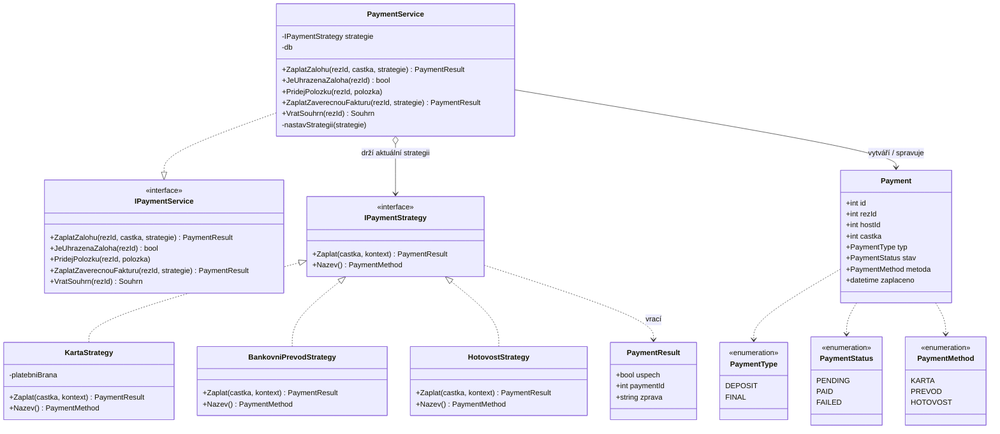
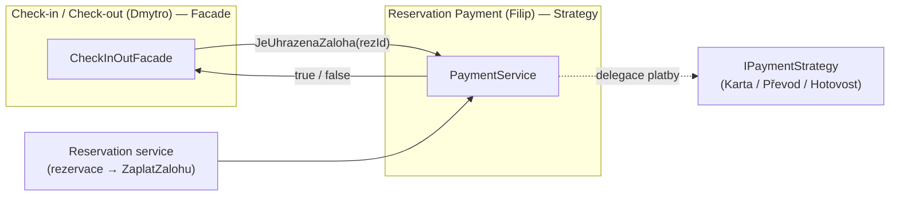

# Reservation Payment — Class Diagram (Strategy)

Author: Filip Tomanka

Návrhový vzor: **Strategy**

- `PaymentService` = **Context** — orchestruje platby, drží aktuálně zvolenou strategii a implementuje veřejné rozhraní modulu `IPaymentService`.
- `IPaymentStrategy` = **Strategy** — rozhraní pro vzájemně zaměnitelné platební metody.
- `KartaStrategy`, `BankovniPrevodStrategy`, `HotovostStrategy` = **ConcreteStrategy** — konkrétní algoritmy provedení platby.
- `IPaymentService` = veřejné rozhraní modulu, přes které volá fasáda check-in/check-out (zejména `JeUhrazenaZaloha(rezId)`).

## Integrace s ostatními moduly

Dohodnutý kontrakt mezi moduly je metoda `JeUhrazenaZaloha(rezId): bool` na rozhraní
`IPaymentService`. Check-in ji volá ve své fasádě (`_platby.JeUhrazenaZaloha(rezId)`) a podle
výsledku povolí, nebo zamítne příjezd hosta. Vše ostatní okolo platby (volba metody, záloha,
finální souhrn služeb) je interní záležitost tohoto modulu.
